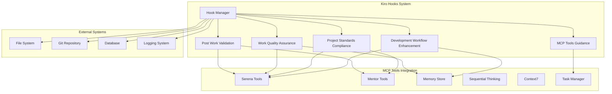

# Kiro Hooks 实现设计文档

## 概述

本设计文档基于需求文档，详细描述了 Kiro Hooks 系统的架构设计、组件接口、数据模型和实现策略。系统将实现 5 个核心钩子，确保开发工作流程的质量保证和规范遵循。

## 架构设计

### 整体架构



### 核心组件

#### 1. Hook Manager (钩子管理器)
负责钩子的注册、调度和生命周期管理。

```typescript
interface HookManager {
  // 钩子注册
  registerHook(hook: Hook): void;
  unregisterHook(hookId: string): void;
  
  // 钩子执行
  executeHook(hookId: string, context: HookContext): Promise<HookResult>;
  executeHooksForEvent(event: HookEvent, context: HookContext): Promise<HookResult[]>;
  
  // 钩子管理
  listHooks(): Hook[];
  getHookStatus(hookId: string): HookStatus;
  enableHook(hookId: string): void;
  disableHook(hookId: string): void;
}
```

#### 2. Hook Base Class (钩子基类)
所有钩子的基础抽象类，定义通用接口和行为。

```typescript
abstract class BaseHook {
  abstract id: string;
  abstract name: string;
  abstract description: string;
  abstract triggers: HookTrigger[];
  
  // 生命周期方法
  abstract execute(context: HookContext): Promise<HookResult>;
  
  // 通用方法
  protected validateContext(context: HookContext): boolean;
  protected logExecution(result: HookResult): void;
  protected handleError(error: Error): HookResult;
}
```

## 组件和接口

### 1. 开发工作流程增强钩子

```typescript
class DevelopmentWorkflowEnhancementHook extends BaseHook {
  id = 'development-workflow-enhancement';
  name = '开发工作流程增强钩子';
  description = '文件编辑时自动触发工作前分析';
  triggers = [
    {
      event: 'file.edit',
      patterns: ['**/*.py', '**/*.ts', '**/*.tsx', '**/*.js', '**/*.jsx', '**/*.md']
    }
  ];

  async execute(context: HookContext): Promise<HookResult> {
    const analysis = new WorkflowAnalysis();
    
    // 阶段1：MCP工具可用性检查
    const mcpAvailability = await this.checkMCPToolsAvailability();
    if (!this.validateMCPToolsReady(mcpAvailability)) {
      return this.createFailureResult('MCP工具未就绪');
    }

    // 阶段2：历史经验分析
    const historicalData = await this.analyzeHistoricalLessons(context.files);

    // 阶段3：架构一致性检查
    const architectureCheck = await this.validateArchitectureConsistency(context.files);

    // 阶段4：冗余检查
    const redundancyCheck = await this.validateRedundancy(context.files);

    // 生成分析报告
    const report = await this.generateAnalysisReport({
      mcpAvailability,
      historicalData,
      architectureCheck,
      redundancyCheck
    });

    return this.createSuccessResult(report);
  }

  private async checkMCPToolsAvailability(): Promise<MCPToolsStatus> {
    return {
      serena: await this.mcpTools.isSerenaAvailable(),
      mentor: await this.mcpTools.isMentorAvailable(),
      memory: await this.mcpTools.isMemoryAvailable(),
      sequentialThinking: await this.mcpTools.isSequentialThinkingAvailable(),
      context7: await this.mcpTools.isContext7Available(),
      taskManager: await this.mcpTools.isTaskManagerAvailable()
    };
  }
}
```

### 2. 项目标准合规检查钩子

```typescript
class ProjectStandardsComplianceHook extends BaseHook {
  id = 'project-standards-compliance';
  name = '项目标准合规检查钩子';
  description = '提交前自动执行全面合规检查';
  triggers = [
    {
      event: 'git.beforeCommit',
      patterns: ['**/*']
    }
  ];

  async execute(context: HookContext): Promise<HookResult> {
    const complianceResults = {
      pythonCompliance: await this.checkPythonCompliance(context.files),
      typescriptCompliance: await this.checkTypescriptCompliance(context.files),
      testingCompliance: await this.checkTestingCompliance(context.files),
      securityCompliance: await this.checkSecurityCompliance(context.files),
      windowsCompliance: await this.checkWindowsCompliance(context.files)
    };

    const overallResult = this.validateOverallCompliance(complianceResults);
    
    if (!overallResult.passed) {
      return this.createFailureResult(
        `合规检查失败: ${overallResult.failures.join(', ')}`,
        overallResult
      );
    }

    return this.createSuccessResult(overallResult);
  }

  private async checkPythonCompliance(files: string[]): Promise<ComplianceResult> {
    const pythonFiles = files.filter(f => f.endsWith('.py'));
    if (pythonFiles.length === 0) return { passed: true, issues: [] };

    const checks = await Promise.all([
      this.serena.styleCheck(pythonFiles, { standard: 'pep8' }),
      this.serena.complexityCheck(pythonFiles, { maxComplexity: 10 }),
      this.checkTypeAnnotations(pythonFiles),
      this.checkAsyncUsage(pythonFiles),
      this.checkExceptionHandling(pythonFiles)
    ]);

    return this.aggregateCheckResults(checks);
  }
}
```

### 3. 工作质量保证钩子

```typescript
class WorkQualityAssuranceHook extends BaseHook {
  id = 'work-quality-assurance';
  name = '工作质量保证钩子';
  description = '完整的工作质量保证流程';
  triggers = [
    {
      event: 'work.start',
      patterns: ['**/*']
    },
    {
      event: 'work.progress',
      patterns: ['**/*']
    }
  ];

  async execute(context: HookContext): Promise<HookResult> {
    switch (context.event) {
      case 'work.start':
        return await this.executePreWorkAnalysis(context);
      case 'work.progress':
        return await this.executeProgressMonitoring(context);
      default:
        return this.createFailureResult('未知的工作事件');
    }
  }

  private async executePreWorkAnalysis(context: HookContext): Promise<HookResult> {
    // 技术栈一致性检查
    const techStackCheck = await this.validateTechStackConsistency(context.files);
    
    // 代码质量预检查
    const codeQualityCheck = await this.executeCodeQualityPreCheck(context.files);
    
    // 测试覆盖率预分析
    const testCoverageCheck = await this.analyzeTestCoverageRequirements(context.files);

    const analysis = {
      techStackConsistency: techStackCheck,
      codeQuality: codeQualityCheck,
      testCoverage: testCoverageCheck,
      readyToProceed: this.isReadyToProceed({
        techStackCheck,
        codeQualityCheck,
        testCoverageCheck
      })
    };

    if (!analysis.readyToProceed) {
      return this.createFailureResult('工作前分析未通过', analysis);
    }

    return this.createSuccessResult(analysis);
  }
}
```

## 数据模型

### 核心数据结构

```typescript
// 钩子上下文
interface HookContext {
  event: HookEvent;
  files: string[];
  metadata: Record<string, any>;
  timestamp: Date;
  userId?: string;
  sessionId?: string;
}

// 钩子结果
interface HookResult {
  success: boolean;
  message: string;
  data?: any;
  errors?: string[];
  warnings?: string[];
  executionTime: number;
  timestamp: Date;
}

// 钩子触发器
interface HookTrigger {
  event: HookEvent;
  patterns: string[];
  conditions?: HookCondition[];
}

// 钩子事件类型
type HookEvent = 
  | 'file.edit'
  | 'file.save'
  | 'git.beforeCommit'
  | 'git.afterCommit'
  | 'work.start'
  | 'work.progress'
  | 'work.complete';

// MCP工具状态
interface MCPToolsStatus {
  serena: boolean;
  mentor: boolean;
  memory: boolean;
  sequentialThinking: boolean;
  context7: boolean;
  taskManager: boolean;
}

// 合规检查结果
interface ComplianceResult {
  passed: boolean;
  score: number;
  issues: ComplianceIssue[];
  recommendations: string[];
}

// 合规问题
interface ComplianceIssue {
  severity: 'critical' | 'high' | 'medium' | 'low';
  category: string;
  description: string;
  file?: string;
  line?: number;
  suggestion?: string;
}

// 质量度量
interface QualityMetrics {
  codeQualityScore: number;
  testCoverageRate: number;
  architectureHealthIndex: number;
  performanceRegression: number;
  securityVulnerabilities: number;
  technicalDebtScore: number;
}
```

### 配置数据模型

```typescript
// 钩子配置
interface HookConfiguration {
  enabled: boolean;
  priority: number;
  timeout: number;
  retryCount: number;
  conditions: HookCondition[];
  parameters: Record<string, any>;
}

// 质量标准配置
interface QualityStandards {
  codeQuality: {
    minimumScore: number;
    strictMode: boolean;
    noAnyType: boolean;
  };
  testCoverage: {
    unitTests: number;
    integrationTests: number;
    criticalPaths: number;
  };
  performance: {
    apiResponseTime: number;
    pageLoadTime: number;
    resourceUtilization: {
      memory: number;
      cpu: number;
    };
  };
  security: {
    allowedVulnerabilities: {
      critical: number;
      high: number;
      medium: number;
    };
  };
}
```

## 错误处理

### 错误分类和处理策略

```typescript
// 错误类型定义
enum HookErrorType {
  CONFIGURATION_ERROR = 'CONFIGURATION_ERROR',
  MCP_TOOL_UNAVAILABLE = 'MCP_TOOL_UNAVAILABLE',
  VALIDATION_FAILED = 'VALIDATION_FAILED',
  TIMEOUT_ERROR = 'TIMEOUT_ERROR',
  SYSTEM_ERROR = 'SYSTEM_ERROR'
}

// 错误处理器
class HookErrorHandler {
  static handle(error: Error, context: HookContext): HookResult {
    const hookError = this.classifyError(error);
    
    switch (hookError.type) {
      case HookErrorType.MCP_TOOL_UNAVAILABLE:
        return this.handleMCPToolError(hookError, context);
      case HookErrorType.VALIDATION_FAILED:
        return this.handleValidationError(hookError, context);
      case HookErrorType.TIMEOUT_ERROR:
        return this.handleTimeoutError(hookError, context);
      default:
        return this.handleGenericError(hookError, context);
    }
  }

  private static handleMCPToolError(error: HookError, context: HookContext): HookResult {
    return {
      success: false,
      message: `MCP工具不可用: ${error.message}`,
      errors: [error.message],
      data: {
        suggestedAction: '请检查MCP工具配置并重试',
        retryable: true
      },
      executionTime: 0,
      timestamp: new Date()
    };
  }
}
```

## 测试策略

### 单元测试

```typescript
// 钩子单元测试示例
describe('DevelopmentWorkflowEnhancementHook', () => {
  let hook: DevelopmentWorkflowEnhancementHook;
  let mockMCPTools: jest.Mocked<MCPToolsManager>;

  beforeEach(() => {
    mockMCPTools = createMockMCPTools();
    hook = new DevelopmentWorkflowEnhancementHook(mockMCPTools);
  });

  describe('execute', () => {
    it('应该在MCP工具可用时成功执行', async () => {
      // Given
      const context = createTestContext(['test.ts']);
      mockMCPTools.isSerenaAvailable.mockResolvedValue(true);
      mockMCPTools.isMemoryAvailable.mockResolvedValue(true);

      // When
      const result = await hook.execute(context);

      // Then
      expect(result.success).toBe(true);
      expect(result.data).toBeDefined();
    });

    it('应该在MCP工具不可用时失败', async () => {
      // Given
      const context = createTestContext(['test.ts']);
      mockMCPTools.isSerenaAvailable.mockResolvedValue(false);

      // When
      const result = await hook.execute(context);

      // Then
      expect(result.success).toBe(false);
      expect(result.message).toContain('MCP工具未就绪');
    });
  });
});
```

### 集成测试

```typescript
// 钩子集成测试
describe('Hook Integration Tests', () => {
  let hookManager: HookManager;
  let testFiles: string[];

  beforeEach(async () => {
    hookManager = new HookManager();
    testFiles = await createTestFiles();
  });

  it('应该在文件编辑时触发工作流程增强钩子', async () => {
    // Given
    const hook = new DevelopmentWorkflowEnhancementHook();
    hookManager.registerHook(hook);

    // When
    const results = await hookManager.executeHooksForEvent('file.edit', {
      event: 'file.edit',
      files: testFiles,
      metadata: {},
      timestamp: new Date()
    });

    // Then
    expect(results).toHaveLength(1);
    expect(results[0].success).toBe(true);
  });
});
```

## 部署和配置

### 钩子配置文件

```json
{
  "hooks": {
    "development-workflow-enhancement": {
      "enabled": true,
      "priority": 1,
      "timeout": 30000,
      "retryCount": 2,
      "parameters": {
        "mcpToolsRequired": ["serena", "memory", "sequentialThinking"],
        "architectureScoreThreshold": 90,
        "redundancyCheckEnabled": true
      }
    },
    "project-standards-compliance": {
      "enabled": true,
      "priority": 2,
      "timeout": 60000,
      "retryCount": 1,
      "parameters": {
        "pythonStandard": "pep8",
        "typescriptStrict": true,
        "testCoverageThreshold": 85,
        "securityScanEnabled": true
      }
    }
  },
  "qualityStandards": {
    "codeQuality": {
      "minimumScore": 90,
      "strictMode": true,
      "noAnyType": true
    },
    "testCoverage": {
      "unitTests": 80,
      "integrationTests": 60,
      "criticalPaths": 90
    }
  }
}
```

### 部署脚本

```powershell
# Windows PowerShell 部署脚本
param(
    [Parameter(Mandatory=$true)]
    [string]$ProjectPath
)

Write-Output "🚀 开始部署 Kiro Hooks 系统..."

# 创建钩子目录
$HooksDir = Join-Path $ProjectPath ".kiro\hooks"
if (-not (Test-Path $HooksDir)) {
    New-Item -ItemType Directory -Path $HooksDir -Force
    Write-Output "✅ 创建钩子目录: $HooksDir"
}

# 复制钩子文件
$HookFiles = @(
    "development-workflow-enhancement.kiro.hook",
    "project-standards-compliance.kiro.hook",
    "work-quality-assurance.kiro.hook",
    "post-work-quality-validation.kiro.hook",
    "mcp-tools-guidance.kiro.hook"
)

foreach ($file in $HookFiles) {
    $sourcePath = Join-Path $PSScriptRoot "hooks\$file"
    $destPath = Join-Path $HooksDir $file
    
    if (Test-Path $sourcePath) {
        Copy-Item $sourcePath $destPath -Force
        Write-Output "✅ 部署钩子: $file"
    } else {
        Write-Warning "⚠️ 钩子文件不存在: $file"
    }
}

# 验证部署
$deployedHooks = Get-ChildItem $HooksDir -Filter "*.kiro.hook"
Write-Output "📊 部署完成，共部署 $($deployedHooks.Count) 个钩子"

Write-Output "🎉 Kiro Hooks 系统部署完成！"
```

这个设计文档提供了完整的架构设计、组件接口、数据模型和实现策略，为后续的任务实现提供了详细的技术指导。